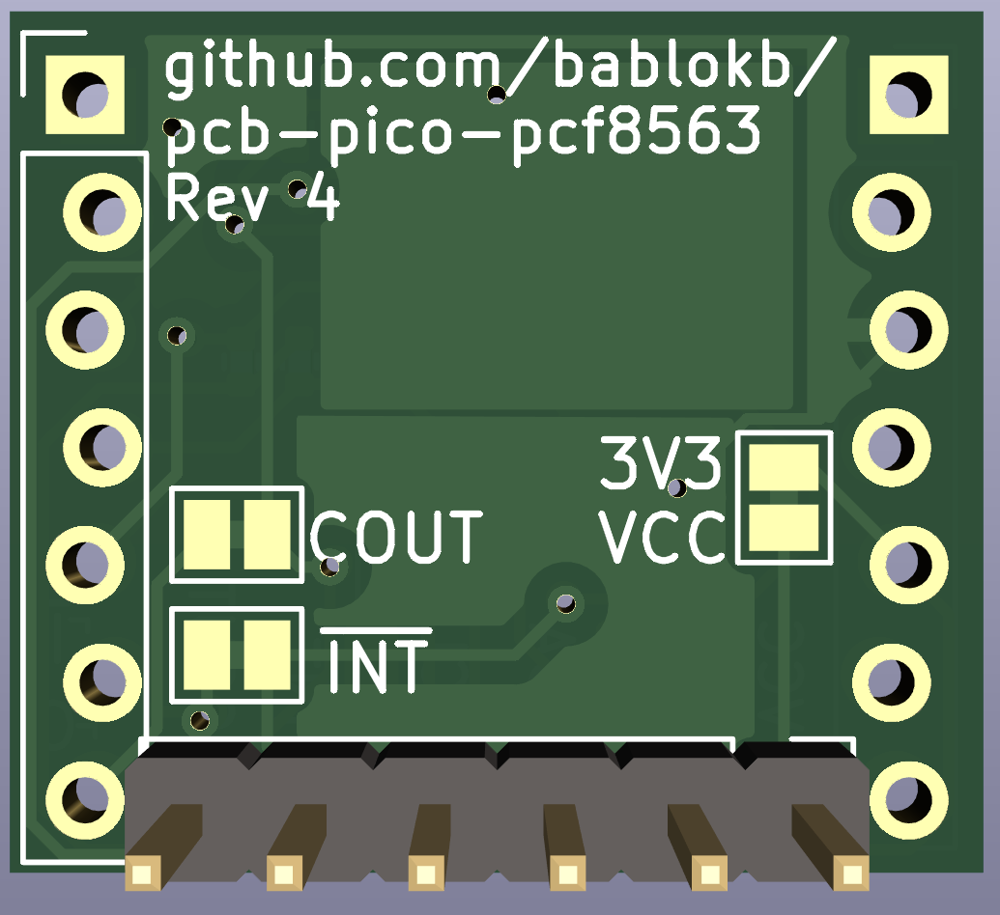
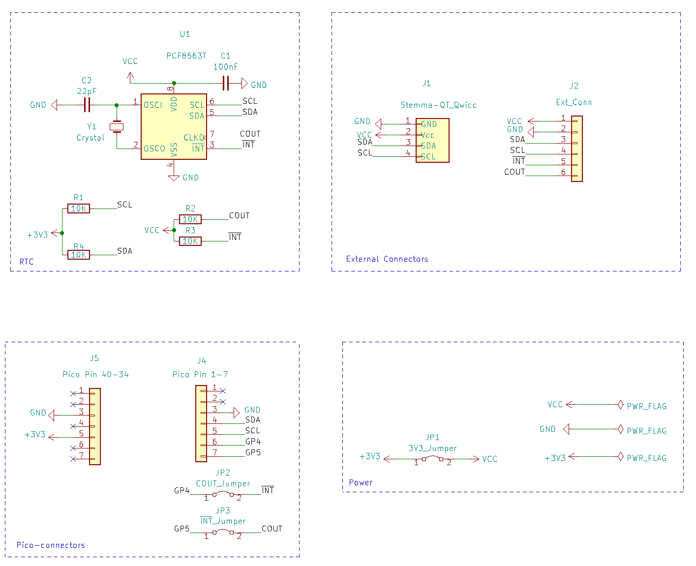

PCB Pico PCF8563
================

This is a breakout with the PCF8563 RTC. It will fit underneath the Pico. It uses
a solderless layout for the Pico-connectors and should hold by itself (but
this is highly dependent on e.g. your pins). As always, this is for prototyping,
you should solder the connectors for permanent projects and best results.

*Note: in the (current) revision 3, the CLKOUT-pin is connected to GP4.
This gpio is not able to measure clock-frequency using hardware-PWM. The
next revision will therefore swap GP4 (CLKOUT) and GP5 (INT).*

Ready to use production-files for JLCPCB are in the directory `production_files`.

Special use Jumpers
-------------------

There are three jumpers on the back for special use cases. You can cut the
trace between the jumper marked '3V3 VCC'. The RTC is then only powered by
one of the external connectors (pins or Stemma/Qt) and keeps on running
even if the Pico is shutdown.

The I2C pullups are hard-wired to 3V3, so even when powering the RTC
from an external source, you must still connect the 3V3-pin of the Pico
to the breakout.

If the external voltage is higher than 3V3 (e.g. from a LiPo), you should
also cut the traces labeled COUT and INT to protect the Pico.

License
-------

[![CC BY-SA 4.0][cc-by-sa-shield]][cc-by-sa]

This work is licensed under a
[Creative Commons Attribution-ShareAlike 4.0 International
License][cc-by-sa].

[![CC BY-SA 4.0][cc-by-sa-image]][cc-by-sa]

[cc-by-sa]: http://creativecommons.org/licenses/by-sa/4.0/
[cc-by-sa-image]: https://licensebuttons.net/l/by-sa/4.0/88x31.png
[cc-by-sa-shield]:
https://img.shields.io/badge/License-CC%20BY--SA%204.0-lightgrey.svg
